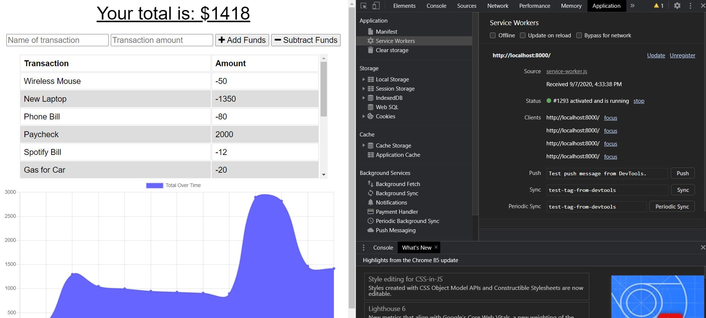
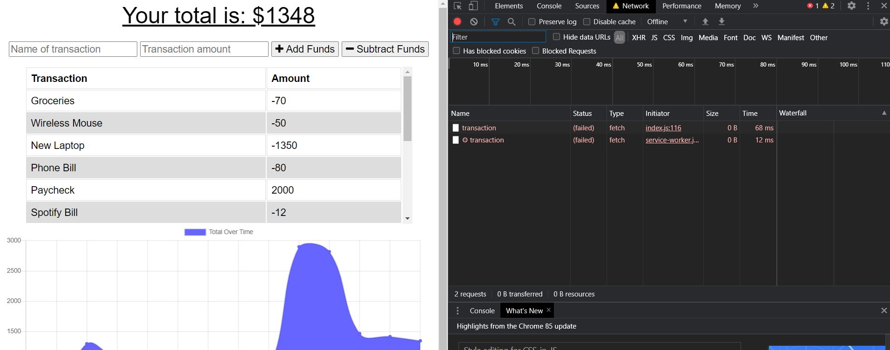
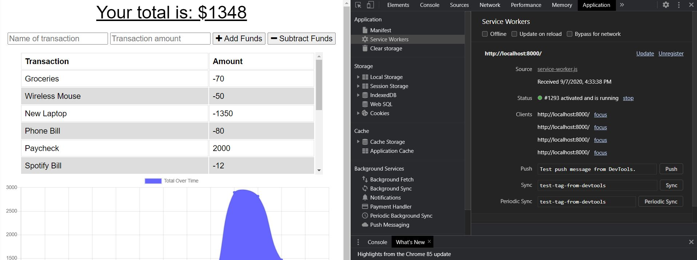

# Budget Tracker

## Description
Adding an offline functionality to an already existing Budget Tracker application. Users will be able to enter deposits and expenses offline. When they are brought back online and the page reloads, their offline entries will be posted once the application.

## Installation
npm install

## License
MIT

## Heroku Link
https://pure-citadel-19700.herokuapp.com/

## Screenshot
### Application running while online.

### Appication is currently offline and an entry has been entered. 

### Application is back online and reloaded. Offline entry has been posted. 

## Questions:
If you have any questions, please feel free to email me at vsomsouk@gmail.com.

